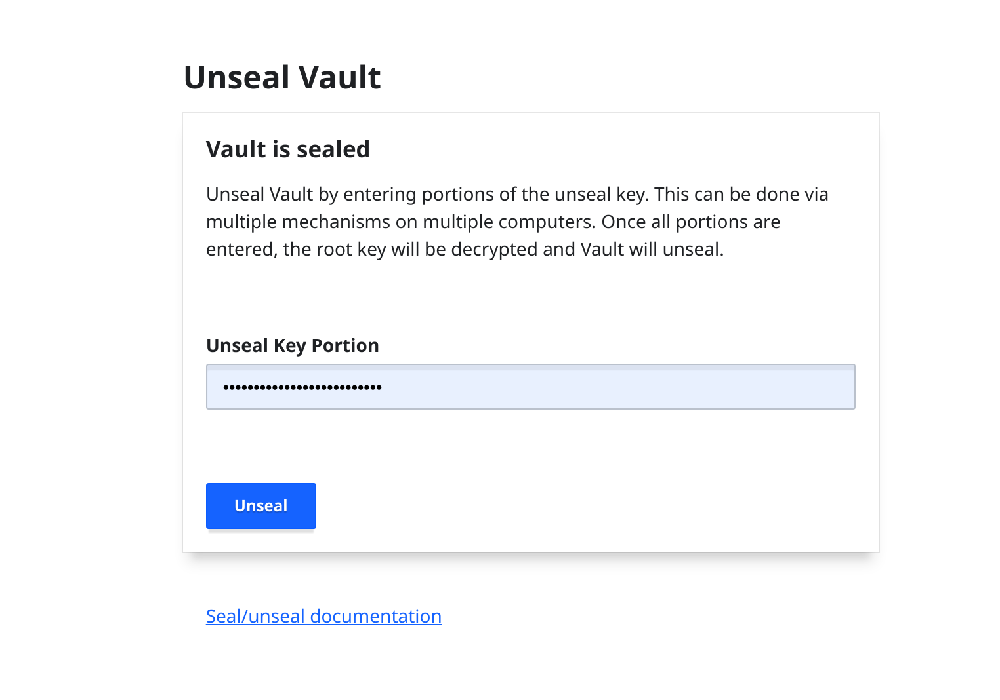
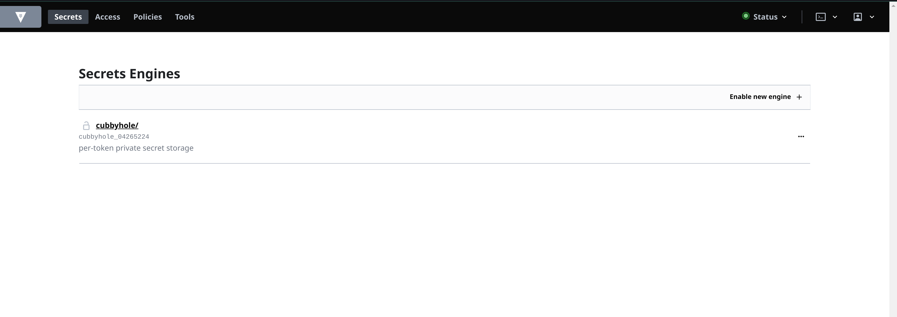

# How to set up Vault

## Step 1: Install & RUN vault  
Sample docker-compose:
```
  vault:
    image: vault:1.8.4
    container_name: myvault
    ports:
      - "8200:8200"
    volumes:
      - ./data/vault/file:/vault/file:rw
      - ./data/vault/config:/vault/config:rw
    cap_add:
      - IPC_LOCK   
    entrypoint: vault server -config=/vault/config/vault.hcl
```

Create config file in `./data/vault/file/vault.hcl` or wherever your volume is setup with  
```
ui = true

backend "file" {
  path = "/vault/file"  
}

listener "tcp" {
  address     = "0.0.0.0:8200"
  tls_disable = 1
}

default_lease_ttl = "168h"
"max_lease_ttl" = "0h"
```


## Step 2: Generate Root Token and Unseal Keys

Go to Vault UI: [http://localhost:8200/ui](http://localhost:8200/ui)


Download File Json Root Token and Unseal Keys

## Step 3: Unseal and Login Vault UI

Enter your keys (copied from the json file) and hit “Unseal”



Enter your root token (copied from the json file) and hit “Sign In”


## Step 4: Enable KV Secret Backend

After Sign in, You’ll be greeted with the following screen.



Click on `Enable New Engine` and then selecting `KV backend` and follow through the setup.


Enter path `secret` and  hit “Enable Engine”


## Step 5: Configure AppRole Auth Method

Select `Access` from the top menu. You’ll see only the `token` method enabled. 

Click `Enable New Method` and select `AppRole`. Leave the settings to default and click `Enable Method`.


## Step 6: Create Policy for Secret Access

Creating a policy that allows access to the KV secret backend.

Select `Policies` from the top menu and click `Create ACL Policy`.


Enter name as `jwt`, and enter following content for `Policy`.

```
path "secret/data/jwt/*" {
  capabilities = ["create", "read", "update", "delete", "list"]
}
```


Following the principle of least privilege, this policy will only give read access to secrets at the specific path.

Hit `Create Policy` to save it.


## Step 7: Create AppRole for Authentication Module
There are two ways to access Vault CLI; you can download the Vault binary, or you can exec into Vault container and access the CLI.

Using exec into Vault container:
```
docker-compose exec vault /bin/sh
```

Then set up the `VAULT_ADDR` and `VAULT_TOKEN` environment variables.

```
export VAULT_ADDR=http://localhost:8200
export VAULT_TOKEN=<ROOT TOKEN>
```

Now let’s create an AppRole and attach our policy to this role. 

```
vault write auth/approle/role/node-app-role \
    token_ttl=1h \
    token_max_ttl=4h \
    token_policies=jwt
```

You should be able to see it being created successfully.

```
Success! Data written to: auth/approle/role/node-app-role
```

Each AppRole has a `RoleID` and `SecretID`, much like a username and password. The application can exchange this `RoleID` and `SecretID` for a token, which can then be used in subsequent requests.

### Get RoleID and SecretID

Now we’ll fetch the `RoleID` pertaining to the node-app-role via the following command:

```
vault read auth/approle/role/node-app-role/role-id
```


Next we’ll fetch the `SecretID`:

```
vault write -f auth/approle/role/node-app-role/secret-id
```


Step 6: Update .env File

```
VAULT_ROLE_ID=2e3fca81-c5a9-2ca9-c24b-273c9c4f4a99
VAULT_SECRET_ID=4c5b5559-bd87-a996-3792-5f9c19f54987
VAULT_END_POINT=http://localhost:8200
VAULT_API_VERSION=v1
VAULT_PATH_SECRET_STORED=secret/data/jwt
```